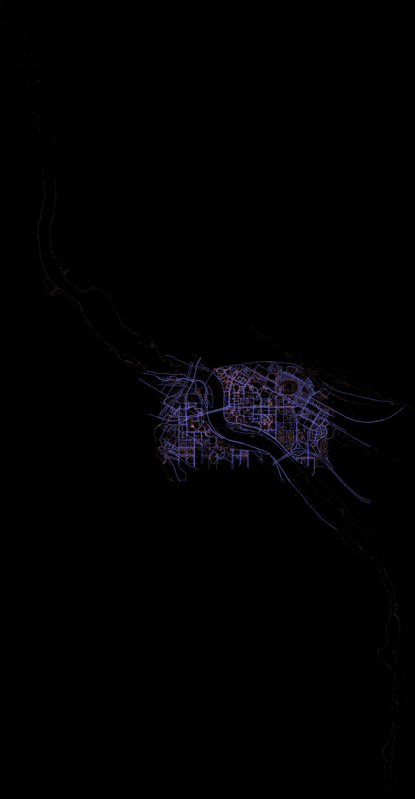

# Map Visualizer

example usage: `bazelisk run //apps/map_viewer '/workspaces/drone_simulation/libs/maps/data/umn.osm' '/workspaces/drone_simulation/apps/map_viewer/'`

produces two images:

1. total.png

2. pruned.png

